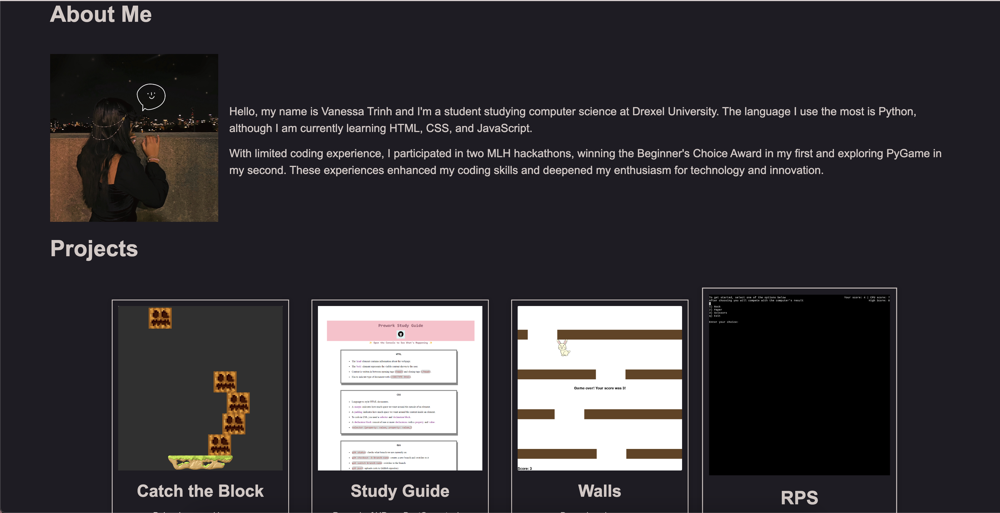
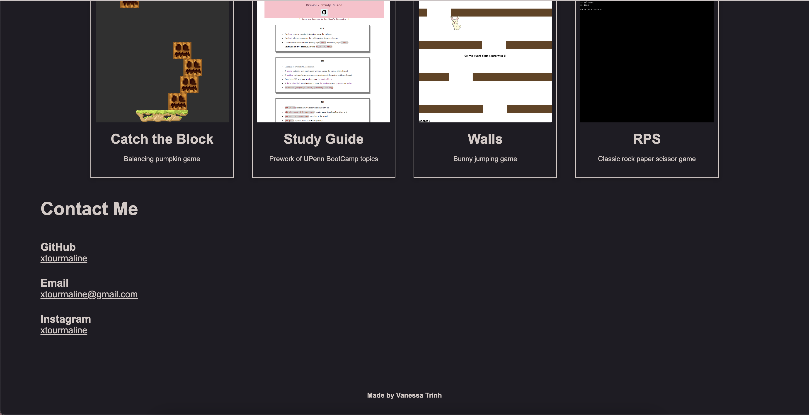

# My Portfolio

## Description

This is my repo containing my portfolio. It is created to display projects I have worked on while also practicing my skills in HTML and CSS. 

As my understanding of these languages progress and I work on more projects, I will continue to update the website.

Check out my website here: https://xtourmaline.github.io/my-portfolio

## Table of Contents

- [Installation](#installation)
- [Photos](#photos)
- [Credits](#credits)
- [License](#license)

## Installation

To view this website, you can use any browser. I used Google Chrome.

## Photos

## License

MIT License